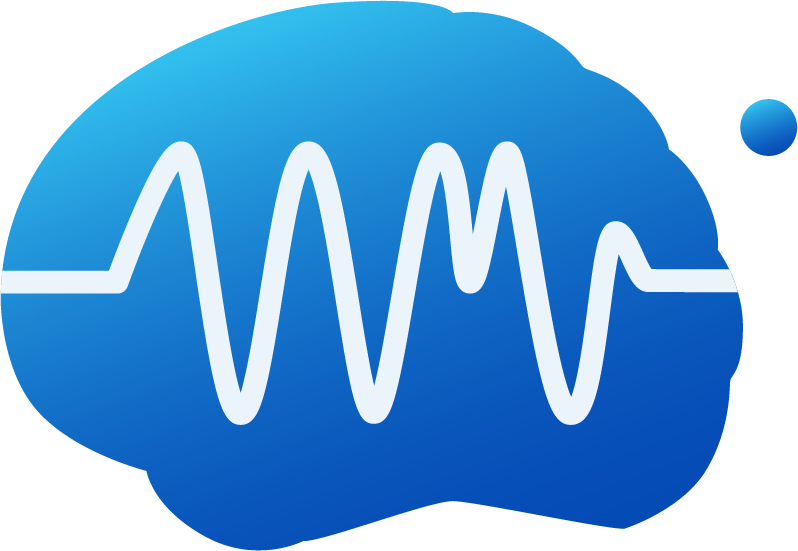
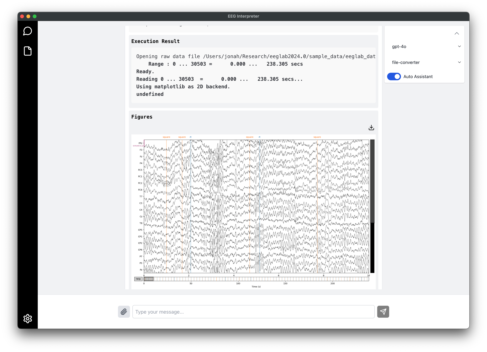
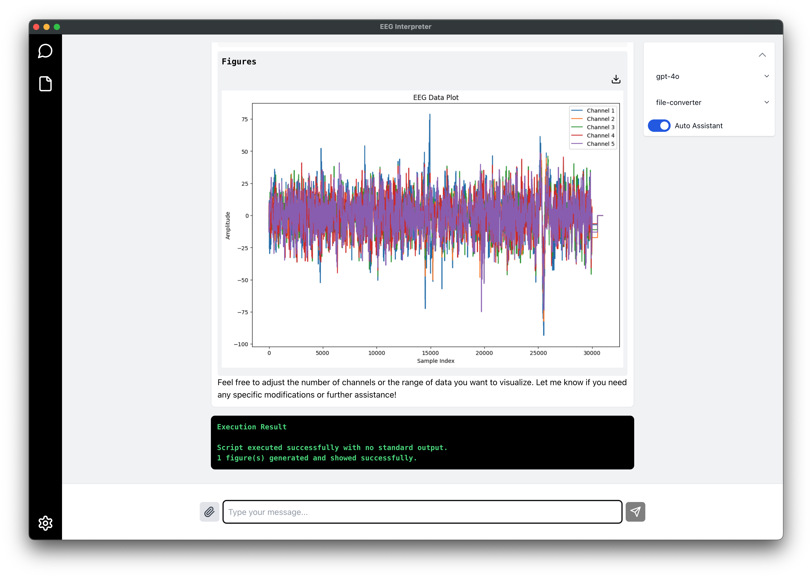

# EEG Interpreter



## Just Chat to Analyze EEG with the power of LLMs




## Sample Data

The sample EEG data file `sample_data/go-nogo-sample.set` is sourced from an openly available dataset on [OpenNeuro](https://openneuro.org/datasets/ds002680/versions/1.2.0). This dataset includes recordings from a go/nogo categorization and detection task. For details about the dataset and experimental protocol, please refer to the OpenNeuro project page.

## For Development

### Install

```bash
$ npm install
```

### Development

```bash
$ npm run dev
```

### Build

```bash
# For windows
$ npm run build:win

# For macOS
$ npm run build:mac

# For Linux
$ npm run build:linux
```
